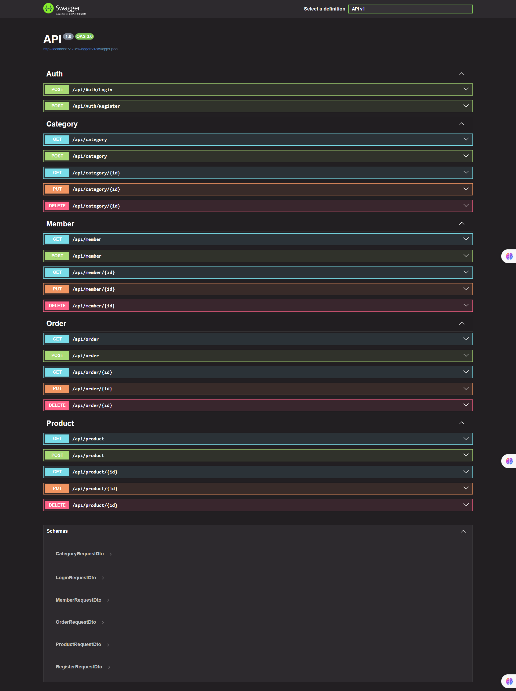
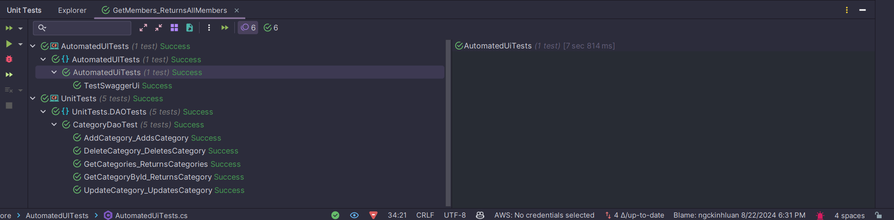

# eStore Repository (Version 8.22.2024)

Welcome to the eStore repository! This project is an API-based application using ASP.NET Core and PostgreSQL.

## About eStore

- eStore is a simple API-based application designed to manage an online store.

- The project is structured using a 3-layer architecture. The **Data Access Layer** contains **Business Objects**, **Data Access Objects (DAOs)**, and **Repositories**, while the **Business Logic Layer** is responsible for managing Services. The **Service Layer** communicates with the **Repository** through interfaces to adhere to **SOLID principles.**

-  The project also implements a **Generic Repository** pattern and uses interfaces such as **ICreateRepository**, **IReadRepository**, **IFindRepository**, **IDeleteRepository** and **IUpdateRepository** to adhere to **SOLID principles.**


### Technology Stack

- **ASP.NET Core**: The framework used to build the API, known for its performance and cross-platform capabilities.
- **PostgreSQL**: The relational database management system used for data storage and management.
- **xUnit and Moq**: Testing frameworks used for writing and running unit tests to ensure code reliability.
- **GitHub Actions**: Used for continuous integration and deployment, automating the build, test, and deployment processes.
- **Selenium**: A framework for automating web browser interactions. It is used to perform end-to-end testing of the web application's UI, ensuring that the application behaves as expected from a user's perspective.
- **NLog**: A flexible and efficient logging framework used to write log files, providing detailed insights into application behavior and errors for easier debugging and monitoring.


## Screenshot



## Setup Instructions

### 1. Configure the Connection String

Update the connection string in the `appsettings.json` file of the `eStore.API` project to match your PostgreSQL database configuration:

```json
{
  "ConnectionStrings": {
    "DefaultConnection": "Host=my_host;Database=my_db;Username=my_user;Password=my_password"
  }
}
```
Replace my_host, my_db, my_user, and my_password with your PostgreSQL database details.

### 2. Add and Update Migration
Run the following commands to create and apply database migrations:

**Add Migration**
```json
dotnet ef migrations add InitialCreate --project eStore.BusinessObjects --startup-project API
```

**Update Database**
```json
dotnet ef database update --project BusinessObjects --startup-project API
```


## Getting Started
To get started with this project:

**Clone the repository**

```json
git clone https://github.com/ngckinhluan/eStore.git
cd eStore
```
**Restore Dependencies:**
```json
dotnet restore
```
**Build the Project:**
```json
dotnet build
```

**Run the application:**
```json
dotnet run --project API
```

**Run Unit Tests and Automated UI Tests with Selenium**
```json
dotnet test
```

## Contact

For any questions or collaboration, connect with me via email: luantnk2907@gmail.com

© 2024 luan.tran


